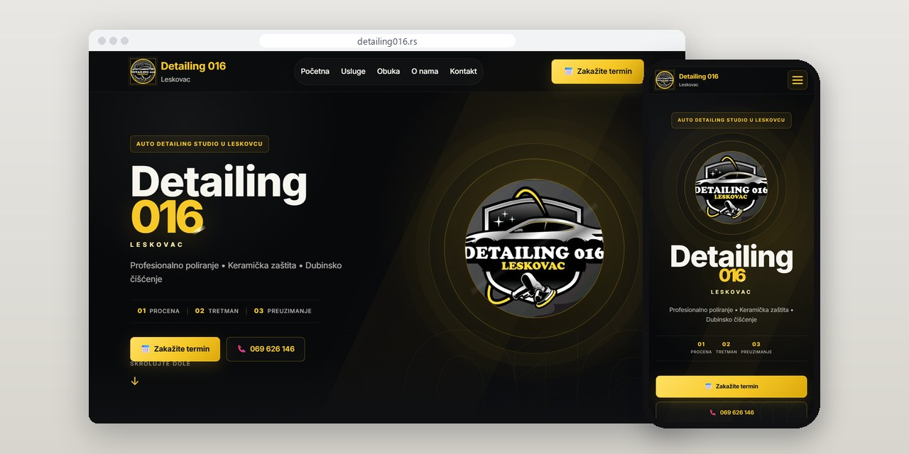
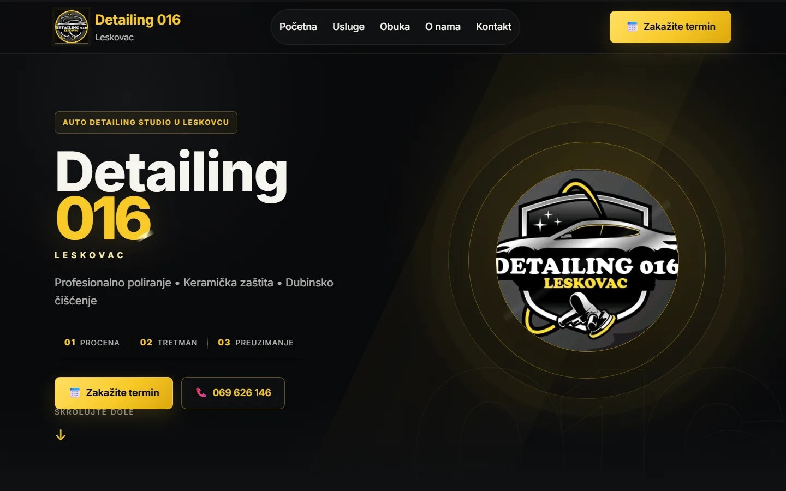
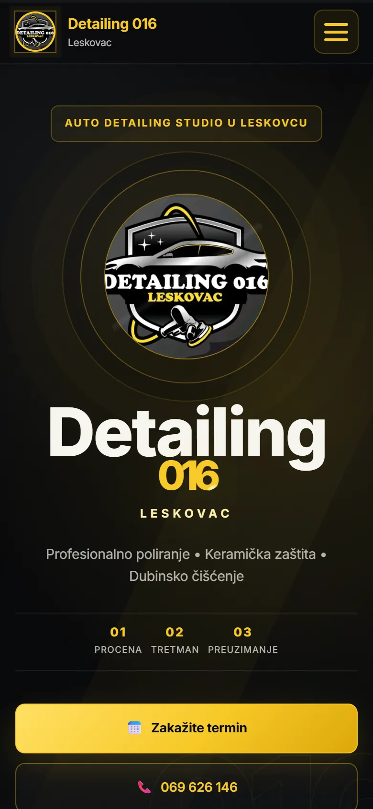
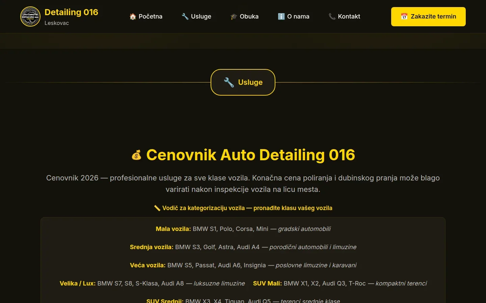
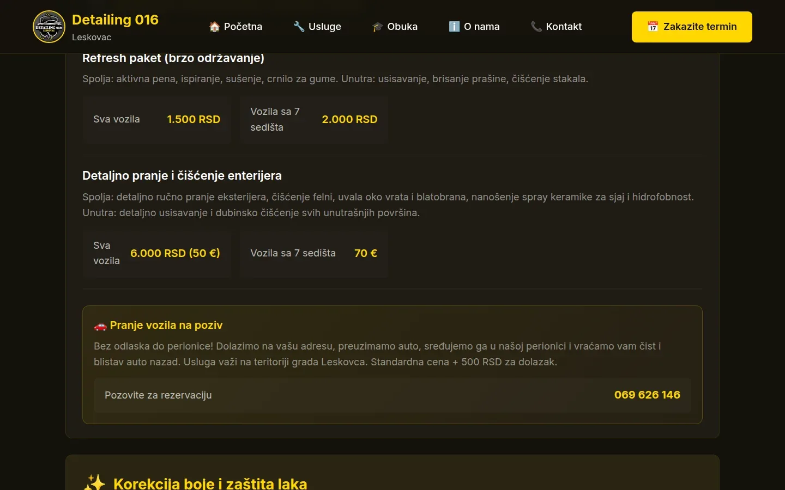

# Detailing 016

Sajt na jednoj strani za auto detailing studio u Leskovcu, sa punim cenovnikom za osam klasa vozila.

**[detailing016.rs](https://detailing016.rs/)** · [Studija slučaja](https://svilenkovic.rs/radovi/detailing-016) · [English](README.md)

> [!NOTE]
> Klijentski projekat. Izvorni kod pripada klijentu i čuva se u privatnom repozitorijumu. Ova stranica opisuje šta sam uradio i kako.

<table>
  <tr><td><b>Klijent</b></td><td>Detailing 016</td></tr>
  <tr><td><b>Delatnost</b></td><td>Auto detailing i obuka jedan na jedan</td></tr>
  <tr><td><b>Lokacija</b></td><td>Leskovac</td></tr>
  <tr><td><b>Vrsta</b></td><td>Sajt na jednoj strani</td></tr>
  <tr><td><b>Moj deo posla</b></td><td>Dizajn, izrada, SEO, hosting i održavanje</td></tr>
  <tr><td><b>Tehnologije</b></td><td>PHP, nginx, JSON-LD, AVIF/WebP</td></tr>
</table>

## O projektu

Detailing 016 radi poliranje, keramičku zaštitu i dubinsko čišćenje automobila u Leskovcu, a vlasnik drži i obuku jedan na jedan. Trebala mu je jedna strana koja odgovara na ono što mušterije inače pitaju telefonom: šta se radi, koliko košta i kako se zakazuje.

Najviše posla je otišlo na cenovnik. Ima sedam grupa usluga i osam klasa vozila sa primerima modela, a tabela za poliranje u istom redu nosi dve cene, sa keramičkom zaštitom i bez nje. Ispod 575 px tabela se pretvara u označene cene složene ispod svake klase, pa na telefonu ništa ne beži u stranu.

## Šta sam uradio

- Ceo cenovnik sa vodičem za klase vozila, čitljiv i na ekranu od 360 px
- Sekcija za obuku sa tri paketa, označena i kao `Course` u strukturisanim podacima
- Kontakt forma koja stvarno stiže: SMTP preko STARTTLS-a sa sandučeta na domenu klijenta, uz SPF, DKIM i DMARC
- Analitika koja čeka pristanak, plus politika privatnosti i uslovi korišćenja pisani baš za ovaj posao
- Strukturisani podaci za firmu, usluge, česta pitanja i kurseve; HTML validator ne prijavljuje nijednu grešku
- Logo u AVIF, WebP i JPEG formatu, a nginx bira onaj koji pregledač prihvata

## Merenja

| | Performanse | Pristupačnost | Dobre prakse | SEO |
| :-- | :-: | :-: | :-: | :-: |
| Telefon | 89 | 100 | 100 | 100 |
| Desktop | 99 | 100 | 100 | 100 |

PageSpeed Insights, laboratorijsko merenje živog sajta, septembar 2026. Sigurnosna zaglavlja: 6 od 6. HTML validator: bez grešaka. axe provera pristupačnosti: bez prekršaja. Strukturisani podaci: `AutomotiveBusiness`, `Course`, `FAQPage`, `Service`.

## Snimci ekrana

<table>
  <tr>
    <td width="68%" valign="top"></td>
    <td width="32%" valign="top"></td>
  </tr>
</table>

Početak cenovnika i vodič za kategorizaciju vozila

Redovno održavanje i korekcija boje sa zaštitom laka

---

Izrada: [D. Svilenković](https://svilenkovic.rs).
